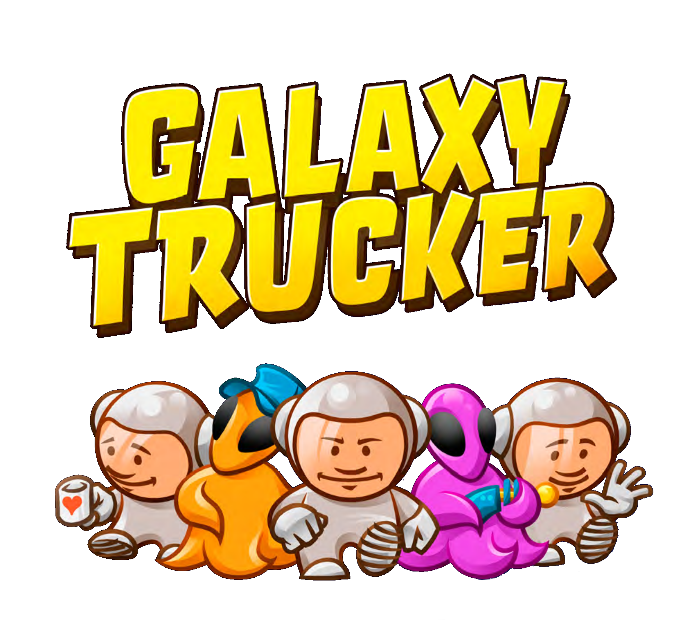

<h3 align="center">
    <a>  </a>
</h3>
<h4 align="center"> IngSw Project - 2024/2025 </h4>
<p align="center">
    Filippo Romano, Davide Ponzo, Alessandro Sarto, Matteo Scuratti
</p>

## Overview

This is a Java recreation of the board game "Galaxy Trucker" made by Vlaada Chvatil and distributed by Cranio Creations, made as an assignment for the Politecnico di Milano software engineering course.

Documentation, UML diagrams, and UML sequence diagrams are available in the folder `deliverables`, organized in their respective folders.

This project was developed using IntelliJ IDEA by JetBrains (Filippo Romano, Davide Ponzo, Alessandro Sarto), and VSCode with the RedHat Java Extension Pack and a Maven standalone executable (Matteo Scuratti), additional use of JavaDoc and resources for the libraries employed (javaFX, JLine3) was used as reference for implementation details and debugging, and for the JDK built-in packages used. Generation of UML Diagrams and Sequence Diagrams was achieved with the help of PlantUML and its pdf/svg rendering routines.

## Advanced Features

We've implemented every feature, both standard and advanced.

> [!IMPORTANT]  
> Due to our multilobby support, reopening every lobby at startup after a crash could be catastrophic as the memory required could've been the very reason the server crashed in the first place, we've chosen to have the server keep track of every unfinished game and save it to disk, deleting the file after everyone left the endgame scoreboard by sending a continue.
All unfinished games are available to load in the lobby setup screen, provided they are loaded by one of the players previously playing.

| Feature                         | Implemented |
|:--------------------------------|:-----------:|
| Level 2 Flight                  |     ✅      |
| TUI                             |     ✅      |
| GUI                             |     ✅      |
| Socket                          |     ✅      |
| RMI                             |     ✅      |
| Multi-lobby Support             |     ✅      |
| Disconnection Resilience        |     ✅      |
| Test Flight Ruleset             |     ✅      |
| Persistence/Game save system    |     ✅      |

### How to start a server

To start a game server, launch the jar with this command, the tcp port can be omitted, the server will choose a random port to use and log it at launch:

`java -jar GC13-server.jar <server-address> [tcp port] <rmi port>`

At any point the server can be closed by typing `stop` in the console, The server is multi-threaded, don't use Ctrl-C to close it, as it will lead to undefined behaviour.

### How to start a game client

> [!TIP]
> TUI: if at any point while connected to a server you don't know what any of the symbols mean, or if you forgot what particular syntax a command might require, type `help` and a helpful screen showing anything you might need will pop up!

> [!IMPORTANT]  
> Make sure to launch the TUI with a terminal emulator having size equal or larger than 128 columns by 32 rows.

#### Windows

If you want to start a client using the TUI, make sure to first run:

```wt --size 128,32```

And then for both types of clients run:

`java -jar GC13-client.jar <tui|gui>`


#### OSX & Linux.

There aren't any specific requirements for linux and OSX, while using the TUI, a monospaced font with basic unicode support should be used, most linux distros use one by default, and OSX runs zsh with a monospaced font by default

`java -jar GC13-client.jar <tui|gui>`


## Notes and tips

To correctly adapt the rules of the boardgame, which employ physical tiles to deepen the gameplay experience, certain rules had to be tweaked slightly to make the game feel coherent in a digital space.

- Dice rolls regarding projectiles and meteors are now automated during construction of the respective classes, so every card containing projectiles is randomized in respect to the row/column it hits during the construction of the deck object. 

- The piles of cards available to see during the level two construction phase are flattened into a single pile of available cards.

- The construction phase and subsequent verification/finalization of the player ships are separated into two distinct game phases, to allow for the automated checks on the ship's correctness.

---

To make sure both client and server stay synced, they both send an extra disconnect message when closing the connection between them, and in case of a client closing, this may be signaled by the server as messages that are being sent by a client that isn't properly connected. You can safely ignore these messages.

RMI is unable to work across a WAN, as it used randomly allocated ports under the hood, a possible solution can be using a VPN, or any tunneling software like Ngrok; Use of TCP when playing remotely is recommended.


