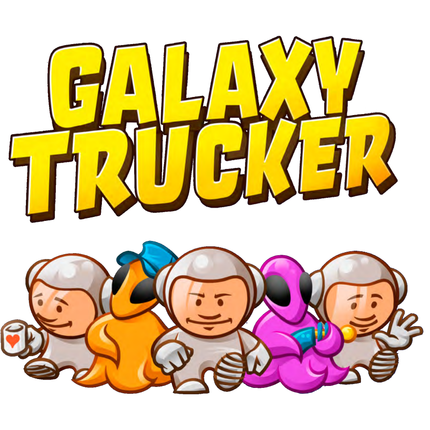
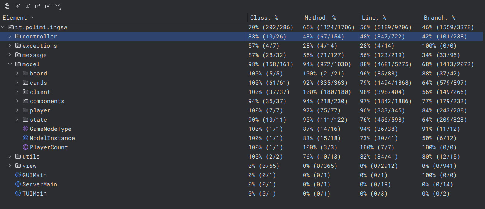

<h3 align="center">
    <a>  </a>
</h3>
<h4 align="center"> IngSw Project - 2024/2025 </h4>
<p align="center">
    Filippo Romano, Davide Ponzo, Alessandro Sarto, Matteo Scuratti
</p>

## Overview

This is a Java recreation of the board game "Galaxy Trucker" made by Vlaada Chvatil and distributed by Cranio Creations, made as an assignment for the Politecnico di Milano software engineering course.

Documentation, UML diagrams, and UML sequence diagrams are available in the folder `deliverables`, organized in their respective folders.

This project was developed using IntelliJ IDEA by JetBrains (Filippo Romano, Davide Ponzo, Alessandro Sarto), and VSCode with the RedHat Java Extension Pack and a Maven standalone executable (Matteo Scuratti), additional use of JavaDoc and resources for the libraries employed (javaFX, JLine3) was used as reference for implementation details and debugging, and for the JDK built-in packages used. Generation of UML Diagrams and Sequence Diagrams was achieved with the help of PlantUML and its pdf/svg rendering routines.

## Advanced Features

We've implemented every feature, both standard and advanced.

> [!IMPORTANT]  
> Due to our multilobby support, reopening every lobby at startup after a crash could be catastrophic as the memory required could've been the very reason the server crashed in the first place, we've chosen to have the server keep track of every unfinished game and save it to disk, deleting the file after everyone left the endgame scoreboard by sending a continue.
All unfinished games are available to load in the lobby setup screen, provided they are loaded by one of the players previously playing.

| Feature                         | Implemented |
|:--------------------------------|:-----------:|
| Level 2 Flight Ruleset          |     ✅      |
| TUI                             |     ✅      |
| GUI                             |     ✅      |
| Socket                          |     ✅      |
| RMI                             |     ✅      |
| Multi-lobby Support             |     ✅      |
| Disconnection Resilience        |     ✅      |
| Test Flight Ruleset             |     ✅      |
| Persistence/Game save system    |     ✅      |

## How to start a server

To start a game server, launch the jar with this command, the tcp port can be omitted, the server will choose a random port to use and log it at launch:

`java -jar GC13-server.jar <server-address> [tcp port] <rmi port>`

At any point the server can be closed by typing `stop` in the console, The server is multi-threaded, don't use Ctrl-C to close it, as it will lead to undefined behaviour.

## How to start a game client

### GUI

> [!CAUTION]
> If you wish to play with a mac, make sure to use the right GUI client jar! The jar made to support Intel Macs is denoted by a _intel in its name, while the unmarked jar supports Apple Silicon.

> [!IMPORTANT]  
> When opening the jar, some warnings regarding unnamed modules may appear, these are due to the shade maven plugin used to build the Jars, which "flattens" modules, making module distinctions moot.

You can start the GUI client by opening the provided .JAR file with:
```java -jar GC13-gui-1.0.jar``` (Make sure to match the name of the jar if youre on an Intel Mac by adding "_intel"!)

#### How to play it.

+ **Lobby and setup state**: If the list is too long for the view port, you can scroll with the mouse wheel to see all available lobbies to join/reopen by clicking them.
+ **Construction State**: Discard a tile by rightclicking it, rotate it by double clicking it, you can pick up discarded tiles by double clicking them in the list.
+ **Verify State**: Drag the showed tiles to remove a component, select the half of the ship you wish to carry (we call them *blobs*!), and drag the crew icons to select a crew type for a cabin, provided that the cabin can support them!
+ **Voyage State**: Each component can have some little markers indicating how much cargo, crew, or batteries it has, they can be removed/discarded by double clicking, and used by dragging them to the needed tile! \
(example, I can move cargo by dragging it from one storage tile to another, provided it supports the cargo type, or I can turn on a component by dragging a battery to it).\
Sometimes cargo is made available by a card state, if you're the receiver of that cargo, you just need to drag it to one of your storage tiles!. \
If a shot is being announced, its accompanied by the index and direction its facing, indexes start from the top left corner at 0.
+ **Ending screen**: As long as your credits are positive, you won! Make sure to signal to continue, as the game only deletes the savefile after everyone makes sure to have read the results.

### TUI

> [!IMPORTANT]  
> Make sure to launch the TUI with a terminal emulator having size equal or larger than 128 columns by 32 rows, using the flag ```--enable-native-access=ALL-UNNAMED``` could be necessary for the JLine library to successfully fetch and load the supported capabilities of the terminal used.

+ Windows: \
A proven way to launch the TUI on windows is to launch a windows terminal instance with ```wt --size 128,32```. The TUI should automatically enable a UTF-8 supporting codepage for any windows terminal, but in case characters are not displayed properly, or the TUI doesn't launch, try forcing any codepage that supports Unicode. You can then finally launch the TUI with ```java --enable-native-access=ALL-UNNAMED -jar GC13-tui-1.0.jar```. 

> [!CAUTION]
> If by any chance this TUI is to be used on a Windows build that doesn't include the new Windows Terminal, you can launch it from Powershell, making sure the size is big enough. (Tested on Windows 11 22H2).

+ Any OS:
Simply launch the jar in a unicode supporting terminal using the command: ```java --enable-native-access=ALL-UNNAMED -jar GC13-tui-1.0.jar```.

> [!TIP]
> If at any point while connected to a server you don't know what any of the symbols mean, or if you forgot what particular syntax a command might require, type `help` and a helpful screen showing anything you might need will pop up! Also, during any card state that requires to land, you can choose not to land using `selectlanding -1`, any other kind of state expects either a penalty or a `sendcontinue` command.

## Developement notes

Testing was mostly done using JUnit and its unit testing utilities, using it we reached a **98% coverage of the model's classes and 94% of its methods**, the controller, being almost wholly comprised of networking related methods and classes, was mostly tested manually as unit testing provided a number of logistical challenges regarding the lack of reproducability of the errors we could, and had, encountered along the developement of this software, any gameplay related functionality (lobby creation, saved games) of the controller was tested.
A screenshot of the coverage for each package is available in the `./deliverables` folder of this repo, and previewed here. 

<h3 align="center">
    <a>  </a>
</h3>

## Notes and tips

To correctly adapt the rules of the boardgame, which employ physical tiles to deepen the gameplay experience, certain rules had to be tweaked slightly to make the game feel coherent in a digital space.

- Dice rolls regarding projectiles and meteors are now automated during construction of the respective classes, so every card containing projectiles is randomized in respect to the row/column it hits during the construction of the deck object. 

- The piles of cards available to see during the level two construction phase are flattened into a single pile of available cards.

- The construction phase and subsequent verification/finalization of the player ships are separated into two distinct game phases, to allow for the automated checks on the ship's correctness.

---

To make sure both client and server stay synced, they both send an extra disconnect message when closing the connection between them, and in case of a client closing, this may be signaled by the server as messages that are being sent by a client that isn't properly connected. You can safely ignore these messages.

RMI is unable to work across a WAN, as it used randomly allocated ports under the hood, a possible solution can be using a VPN, or any tunneling software like Ngrok; Use of TCP when playing remotely is recommended.


